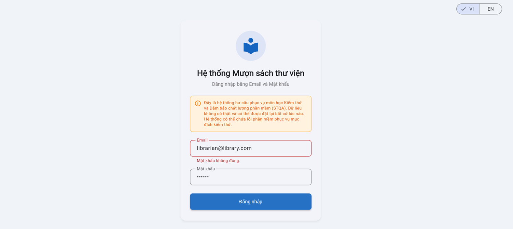
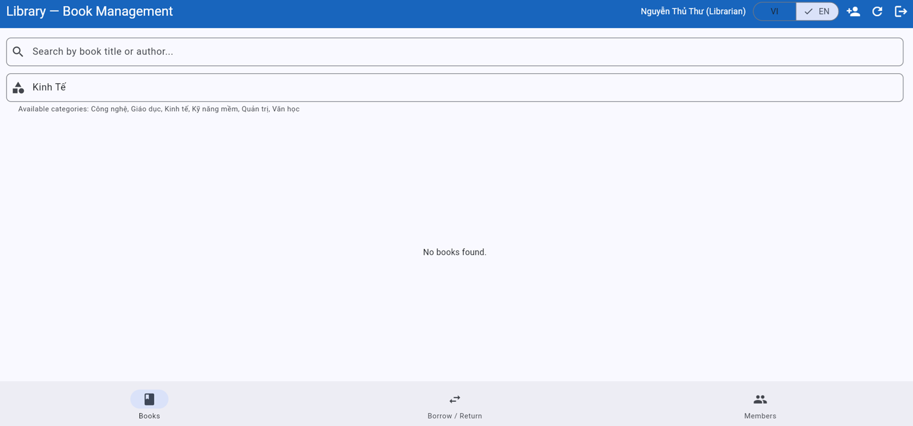
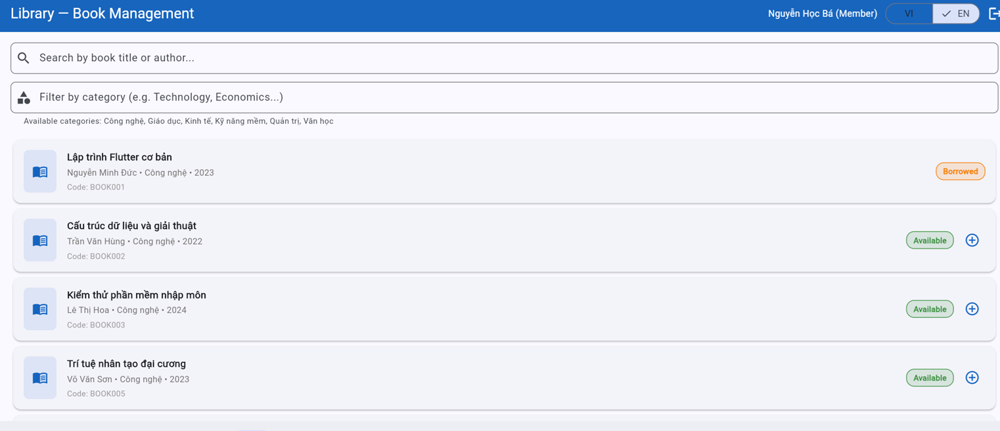
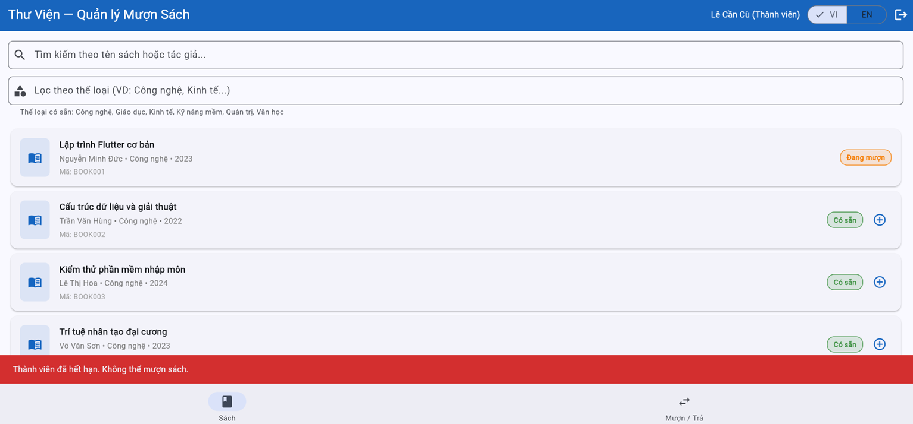
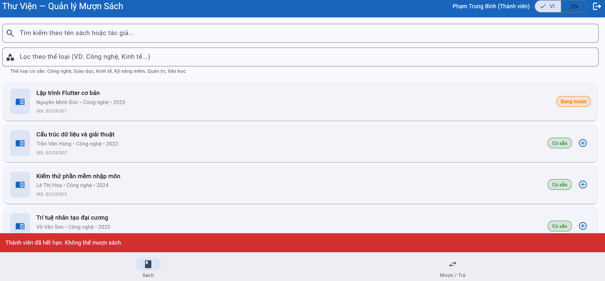
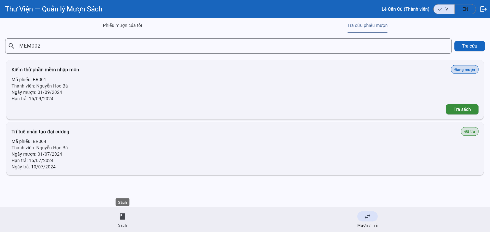
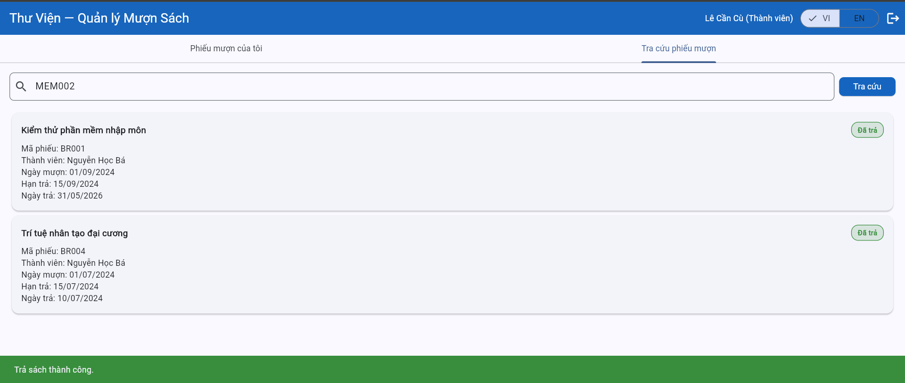

# Bug Reports — Báo cáo lỗi

> **Hướng dẫn**: Tạo 1 mục bug cho mỗi TC có kết quả **Fail**.
> Xem [examples/sample-bug-report.md](../examples/sample-bug-report.md) để hiểu cách viết bug report tốt.
> Mỗi bug cần: tiêu đề mô tả hành vi lỗi, bước tái hiện, expected vs actual, severity + giải thích.

| Information | |
|---|---|
| **Group** | `GROUP_04` |
| **Report Date** | ` 29/05/2026 ` |

---
## BUG-01

| Attribute         | Details          |
| ----------------- | ---------------- |
| **Bug ID**        | BUG_TC04         |
| **Related TC**    | TC-04            |
| **Related REQ**   | REQ-01           |
| **Severity**      | Low              |
| **Reported By**   | Nguyễn Khải Điệp |
| **Date Reported** | 29/05/2026       |
| **Status**        | Open             |

**Environment:**
- Browser: 148.0.7778.217(64 bit)
- OS: Windows 11
- UI Language: Vietnamese

**Precondition**:
The login page is open

**Steps to Reproduce:**
1. Enter valid email
2.  Enter wrong password
3. Click **Login**

**Expected value:**
System shows error message: **"Incorrect password"** in the **Password** field  — different from the message for wrong email. Page does not change.

** Actual Result:**
The system displays the error message "Mật khẩu không đúng" in the **Email** field.The page does not navigate. 

**Impact:**
Affects the user interface and may cause user confusion.

** Proof:**

**Suggested Fix:**
Ensure that the "Incorrect password" validation message is displayed under the Password field instead of the Email field. Verify that validation messages are mapped to the correct input fields.

---

## BUG-02

| Thuộc tính | Chi tiết |
|-----------|---------|
| **Mã lỗi** | BUG-01 |
| **TC liên quan** | TC-12 |
| **REQ liên quan** | REQ-03 |
| **Mức độ** | High |
| **Người phát hiện** | Nguyen Phuc Duc |
| **Ngày phát hiện** |29/05/2026 |
| **Trạng thái** | Open |

**Tiêu đề:**
Category filter does not work and returns an empty result for all valid category values.

**Môi trường:**
- Trình duyệt: Chrome 148.0.7778.179
- Hệ điều hành: Windows 11 IoT Enterprise LTSC
- Ngôn ngữ giao diện: Tiếng Việt

**Điều kiện tiên quyết:**
- Logged into the system as either a Member or Librarian.
- Currently on the Books tab.

**Bước tái hiện:**
1. Enter "Kinh tế" in the category filter field.
2. Apply the filter.
3. Observe the displayed book list.
4. Repeat the test with other valid categories such as "Công nghệ", "Giáo dục", "Quản trị", and "Văn học".

**Kết quả mong đợi:**
The system should display books belonging to the selected category. For example, when entering "Kinh tế", only Economics books should be displayed.
**Kết quả thực tế:**
The system displays the message "No books found". The result list is empty even though books belonging to the selected category exist in the system.

**Tác động:**
Users cannot use the category filtering feature. This violates REQ-03 and causes TC-12 to fail.
**Minh chứng:**

**Đề xuất xử lý:**
Review the category filtering logic and verify that category values are correctly matched against the stored book categories.

--- 

## BUG-03 
| Attribute         | Details          |
| ----------------- | ---------------- |
| **Bug ID**        | BUG_TC33         |
| **Related TC**    | TC-33            |
| **Related REQ**   | REQ-03           |
| **Severity**      | Medium              |
| **Reported By**   | Nguyễn Khải Điệp |
| **Date Reported** | 29/05/2026       |
| **Status**        | Open             |

**Environment:**
- Browser: 148.0.7778.217(64 bit)
- OS: Windows 11
- UI Language: Vietnamese

**Precondition**:
Logged in, on Books tab

**Steps to Reproduce:**
1. Select category "kinh tế" or "KInH tẾ" from the filter
2. Observe the list

**Expected value:**
Shows only 3 books: BOOK007 (Kinh tế vi mô), BOOK014 (Kinh tế vĩ mô), BOOK015 (Nguyên lý kế toán). No books from other categories.

**Actual Result:**
List is empty, shows message "No books found".

**Impact:**
Reduces search efficiency, as users must enter the exact letter casing (uppercase/lowercase) to find matching results.

**Proof:**

**Suggested Fix:**
Make the category filter case-insensitive by normalizing both the user input and stored category values before comparison. The filter should return the same results regardless of uppercase or lowercase letters.

## BUG-04 
| Attribute         | Details          |
| ----------------- | ---------------- |
| **Bug ID**        | BUG_TC14         |
| **Related TC**    | TC-14            |
| **Related REQ**   | REQ-04           |
| **Severity**      | Low              |
| **Reported By**   | Nguyễn Khải Điệp |
| **Date Reported** | 29/05/2026       |
| **Status**        | Open             |

**Environment:**
- Browser: 148.0.7778.217(64 bit)
- OS: Windows 11
- UI Language: Vietnamese

**Precondition**:
**ba.nguyen** is logged in. BOOK003 is "Borrowed" (by MEM002 — BR001 from Seed Data).

**Steps to Reproduce:**
 1. Log in as `ba.nguyen`
 2. Go to **Books** tab → BOOK003 
 3. Click **Borrow** 

**Expected value:**
System rejects and shows error message: book is **unavailable** / already borrowed. No new slip created.

**Actual Result:**
BOOK003 does not have the (+) button,the borrow action cannot be performed.No error message is displayed.

**Impact:**
The absence of a notification message makes it difficult for users to identify the issue.

** Proof:**

**Suggested Fix:**
Display a clear notification message when a book is unavailable or already borrowed. If the Borrow (+) button is hidden for unavailable books, provide a visible status indicator and explanatory message so users understand why the borrow action cannot be performed.

## BUG-05 
| Attribute         | Details          |
| ----------------- | ---------------- |
| **Bug ID**        | BUG_TC15         |
| **Related TC**    | TC-15            |
| **Related REQ**   | REQ-04           |
| **Severity**      | Medium              |
| **Reported By**   | Nguyễn Khải Điệp |
| **Date Reported** | 29/05/2026       |
| **Status**        | Open             |

**Environment:**
- Browser: 148.0.7778.217(64 bit)
- OS: Windows 11
- UI Language: Vietnamese

**Precondition**:
 `cu.le` (MEM004, **Suspended**) is logged in. BOOK001 is "Available". 

**Steps to Reproduce:**
 1. Log in as `cu.le`
 2. Go to Books tab → BOOK001
 3. Click **Borrow**

**Expected value:**
System rejects and shows reason "Suspended" — message must be different from the "Expired" case. No slip created.

**Actual Result:**
System rejects and shows error message:"Thành viên đã hết hạn. Không thể mượn sách."-the same message as the "Expired" case.

**Impact:**
The inaccurate error message may mislead users about the actual cause of the issue.

** Proof:**

**Suggested Fix:**
Display a specific error message for suspended accounts, such as "Member account is suspended. Borrowing books is not allowed." Ensure that suspended and expired account statuses are handled separately and show different messages to accurately reflect the reason for rejection.

## BUG-06 
| Attribute         | Details          |
| ----------------- | ---------------- |
| **Bug ID**        | BUG_TC34         |
| **Related TC**    | TC-34            |
| **Related REQ**   | REQ-04           |
| **Severity**      | High              |
| **Reported By**   | Nguyễn Khải Điệp |
| **Date Reported** | 29/05/2026       |
| **Status**        | Open             |

**Environment:**
- Browser: 148.0.7778.217(64 bit)
- OS: Windows 11
- UI Language: Vietnamese

**Precondition**:
`binh.pham` (MEM005, Expired) is logged in. BOOK001 is "Available".ble". 

**Steps to Reproduce:**
1. Log in as binh.pham
2. Go to Books tab → BOOK001 
3. Click Borrow

**Expected value:**
Shows reason "Thành viên đã hết hạn. Không thể mượn sách." in VI or "The member account has expired. Borrowing books is not allowed." in EN

**Actual Result:**
Shows reason "Thành viên đã hết hạn. Không thể mượn sách." in VI and EN

**Impact:**
Impacts both the user interface and user experience.
** Proof:**

**Suggested Fix:**
Implement proper localization for error messages. When the interface language is set to English, display "The member account has expired. Borrowing books is not allowed." instead of the Vietnamese message. Ensure all system messages are translated according to the selected language setting.
## BUG-07

| Thuộc tính | Chi tiết |
|-----------|---------|
| **Mã lỗi** | BUG-02 |
| **TC liên quan** | TC-25 |
| **REQ liên quan** | REQ-07 |
| **Mức độ** | High |
| **Người phát hiện** | Nguyen Phuc Duc |
| **Ngày phát hiện** | 29/05/2026 |
| **Trạng thái** | open |

**Tiêu đề:**
The system rejects valid email addresses when adding a new member.

**Môi trường:**
- Trình duyệt: Chrome 148.0.7778.179
- Hệ điều hành: Windows 11 IoT Enterprise LTSC
- Ngôn ngữ giao diện: Tiếng Việt

**Điều kiện tiên quyết**
- Logged in as a Librarian.

**Bước tái hiện:**
1. Open the Add New Member form.
2. Enter a valid full name (e.g., Nguyen Van A).
3. Enter a valid email address (e.g., test@gmail.com).
4. Enter a valid phone number (e.g., 0981677166).
5. Click the "Add Member" button.

**Kết quả mong đợi:**
The system should accept the valid email address and successfully create a new member record.

**Kết quả thực tế:**
The system displays the error message "Invalid email address" and prevents member creation.

**Tác động:**
Librarians cannot add new members. The Member Management feature (REQ-07) becomes unusable and TC-25 fails.
**Minh chứng:**

**Đề xuất xử lý:**
Review the email validation logic and ensure that valid email formats are accepted correctly.

---

## BUG-08

| Thuộc tính | Chi tiết |
|-----------|---------|
| **Mã lỗi** | BUG-03 |
| **TC liên quan** | TC-18 |
| **REQ liên quan** | REQ-04 |
| **Mức độ** | High |
| **Người phát hiện** | Nguyen Phuc Duc |
| **Ngày phát hiện** | 29/05/2026 |
| **Trạng thái** | Open |

**Tiêu đề:**
The system allows a member to borrow more than the maximum limit of three books.

**Môi trường:**
- Trình duyệt: Chrome 148.0.7778.179
- Hệ điều hành: Windows 11 IoT Enterprise LTSC
- Ngôn ngữ giao diện: Tiếng Việt

**Điều kiện tiên quyết:**
Member account is active.
At least four books are available for borrowing.

**Bước tái hiện:**
1. log in account member Trần Dực Dẫm.
2. Borrow "Lập trình Flutter cơ bản".
3. Borrow "Cấu trúc dữ liệu và giải thuật".
4. Borrow "Trí tuệ nhân tạo đại cương".
5. Borrow "Mạng máy tính".

**Kết quả mong đợi:**
When a member has already borrowed three books, the system should reject any additional borrowing request and display a message indicating that the borrowing limit has been reached.
**Kết quả thực tế:**
The system creates an additional borrowing record, allowing the member to have four active borrowed books at the same time.

**Tác động:**
This violates the borrowing limit business rule, causes inaccurate borrowing records, and results in TC-18 failing.

**Minh chứng:**

**Đề xuất xử lý:**
Verify the borrowing validation logic before creating a new borrowing record. The system should only allow borrowing when the number of active loans is less than three.

---

## BUG-09

| Thuộc tính | Chi tiết |
|-----------|---------|
| **Mã lỗi** | BUG-04 |
| **TC liên quan** | TC-09 |
| **REQ liên quan** | REQ-03 |
| **Mức độ** | Medium |
| **Người phát hiện** | Nguyen Phuc Duc |
| **Ngày phát hiện** |31/05/2026 |
| **Trạng thái** | Open |

**Tiêu đề:**
Search function does not return matching books when using valid Vietnamese and non-accented keywords.

**Môi trường:**
- Trình duyệt: Chrome 148.0.7778.179
- Hệ điều hành: Windows 11 IoT Enterprise LTSC
- Ngôn ngữ giao diện: Tiếng Việt

**Điều kiện tiên quyết:**
- User is logged into the system.
- User is on the Books tab.
- The book "Lập trình Flutter cơ bản" exists in the book list.

**Bước tái hiện:**
1. Enter the keyword "Lập" into the search box.
2. Observe the search results.
3. Clear the search box.
4. Enter the keyword "lap" into the search box.
5. Observe the search results.

**Kết quả mong đợi:**
The system should display the book "Lập trình Flutter cơ bản" because its title matches the entered keywords.
**Kết quả thực tế:**
The system displays "No books found" for both "Lập" and "lap", even though the matching book exists in the system.

**Tác động:**
Users cannot reliably search for books using Vietnamese keywords or non-accented keywords. This affects the Search Books feature and causes TC-09 to fail.

**Minh chứng:**

**Đề xuất xử lý:**
Review the search logic and ensure that the system supports partial keyword matching, Vietnamese characters, and non-accented keyword normalization.

---

## BUG-10

| Thuộc tính | Chi tiết |
|-----------|---------|
| **Mã lỗi** | BUG-05 |
| **TC liên quan** | TC-15 |
| **REQ liên quan** | REQ-04 |
| **Mức độ** | Low |
| **Người phát hiện** | Nguyen Phuc Duc |
| **Ngày phát hiện** |31/05/2026 |
| **Trạng thái** | Open |

**Tiêu đề:**
System displays an incorrect rejection reason when a suspended member attempts to borrow a book.

**Môi trường:**
- Trình duyệt: Chrome 148.0.7778.179
- Hệ điều hành: Windows 11 IoT Enterprise LTSC
- Ngôn ngữ giao diện: Tiếng Việt

**Điều kiện tiên quyết:**
- Logged in with a suspended member account (e.g., cu.le@email.com).
- At least one book is available for borrowing.

**Bước tái hiện:**
1. Select an available book from the Books tab.
2. Click the Borrow button.
3. Observe the displayed error message.

**Kết quả mong đợi:**
The system should reject the borrowing request and display a message indicating that the member account is 'suspended'.
**Kết quả thực tế:**
Member account has expired. Borrowing is not allowed.

**Tác động:**
- Provides incorrect information about the member's account status.
- Violates the business rule requiring the system to display the correct rejection reason.
- May confuse users and librarians when troubleshooting account issues.
- Causes TC-15 to fail.

**Minh chứng:**

**Đề xuất xử lý:**
Review the account status validation logic and ensure that suspended accounts display a suspension-related message instead of an expiration-related message.

## BUG-11

| Thuộc tính | Chi tiết |
|-----------|---------|
| **Mã lỗi** | BUG-011 |
| **TC liên quan** | TC-32 |
| **REQ liên quan** | REQ-05 |
| **Mức độ** | High |
| **Người phát hiện** | Nguyen Phuc Duc |
| **Ngày phát hiện** |31/05/2026 |
| **Trạng thái** | Open |

**Tiêu đề:**
Member can view borrowing records of another member.

**Môi trường:**
- Trình duyệt: Chrome 148.0.7778.179
- Hệ điều hành: Windows 11 IoT Enterprise LTSC
- Ngôn ngữ giao diện: Tiếng Việt

**Điều kiện tiên quyết:**
- Logged in with a suspended member account (e.g., cu.le@email.com).
- Another member account exists in the system with borrowing records.

**Bước tái hiện:**
1. Navigate to the Borrow / Return screen.
2. Open the "Tra cứu phiếu mượn" tab.
3. Enter another member's ID (e.g., MEM002) into the search field.
4. Click the "Tra cứu" button.
5. Observe the displayed borrowing records.

**Kết quả mong đợi:**
The system should only allow a member to view their own borrowing records. Access to other members' borrowing records must be denied.

**Kết quả thực tế:**
The system displays borrowing records belonging to another member (Nguyen Hoc Ba).

**Tác động:**
- Violates access control and privacy requirements.
- Exposes borrowing information of other members.
- Allows unauthorized access to personal borrowing records.
- Causes the related test case to fail.

**Minh chứng:**

**Đề xuất xử lý:**
Implement access control validation to ensure members can only access their own borrowing records. Search requests should be restricted to the currently authenticated member.

## BUG-12

| Thuộc tính | Chi tiết |
|-----------|---------|
| **Mã lỗi** | BUG-12 |
| **TC liên quan** | TC-24 |
| **REQ liên quan** | REQ-05 |
| **Mức độ** | High |
| **Người phát hiện** | Nguyen Phuc Duc |
| **Ngày phát hiện** |31/05/2026 |
| **Trạng thái** | Open |

**Tiêu đề:**
Member can return books belonging to another member.

**Môi trường:**
- Trình duyệt: Chrome 148.0.7778.179
- Hệ điều hành: Windows 11 IoT Enterprise LTSC
- Ngôn ngữ giao diện: Tiếng Việt

**Điều kiện tiên quyết:**
- Logged in with a suspended member account (e.g., cu.le@email.com).
- Another member account exists in the system with borrowing records.

**Bước tái hiện:**
1. Navigate to the Borrow / Return screen.
2. Open the "Tra cứu phiếu mượn" tab.
3. Enter another member's ID (e.g., MEM002).
4. Click the "Tra cứu" button.
5. Locate a borrowing record belonging to that member.
6. Click the "Trả sách" button.
7. Observe the system response and borrowing record status.

**Kết quả mong đợi:**
The system must prevent members from modifying borrowing records that belong to other members. The Return Book action should only be available for the owner of the borrowing record or authorized librarians.

**Kết quả thực tế:**
The system allows a member to return a book belonging to another member and displays the message "Trả sách thành công."

**Tác động:**
- Violates access control requirements.
- Allows unauthorized modification of another member's borrowing records.
- Causes inaccurate borrowing history and inventory data.
- Creates a serious security and data integrity issue.

**Minh chứng:**

**Đề xuất xử lý:**
Implement authorization checks before processing return requests. The system should verify that the borrowing record belongs to the currently authenticated user or that the user has librarian privileges.

<!-- Copy template BUG trên để thêm BUG-03, BUG-04, ... cho mỗi TC Fail -->
