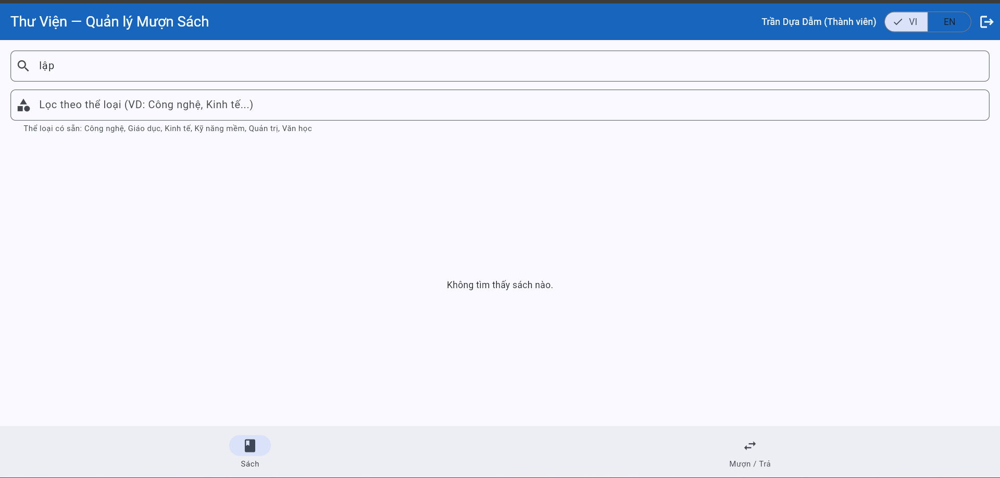
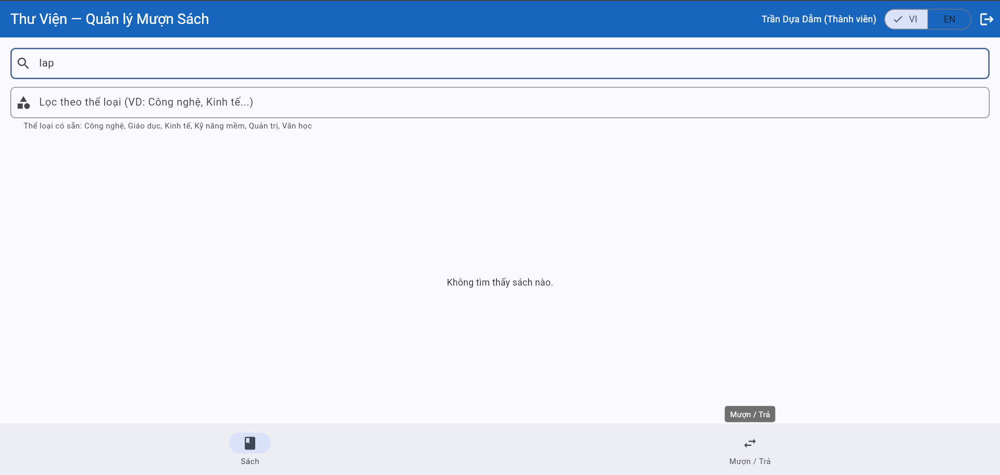

# Bug Reports — Báo cáo lỗi

> **Hướng dẫn**: Tạo 1 mục bug cho mỗi TC có kết quả **Fail**.
> Xem [examples/sample-bug-report.md](../examples/sample-bug-report.md) để hiểu cách viết bug report tốt.
> Mỗi bug cần: tiêu đề mô tả hành vi lỗi, bước tái hiện, expected vs actual, severity + giải thích.

| Thông tin | |
|---|---|
| **Nhóm** | `<!-- Tên nhóm -->` |
| **Ngày báo cáo** | `<!-- DD/MM/YYYY -->` |

---

## BUG-01

| Thuộc tính | Chi tiết |
|-----------|---------|
| **Mã lỗi** | BUG-01 |
| **TC liên quan** | `<!-- TC-xx -->` |
| **REQ liên quan** | `<!-- REQ-xx -->` |
| **Mức độ** | `<!-- High / Medium / Low -->` |
| **Người phát hiện** | `<!-- Họ tên thành viên -->` |
| **Ngày phát hiện** | `<!-- DD/MM/YYYY -->` |
| **Trạng thái** | `<!-- Open / Closed -->` |

**Tiêu đề:**
`<!-- Mô tả hành vi lỗi cụ thể -->`

**Môi trường:**
- Trình duyệt: Chrome `<!-- version -->`
- Hệ điều hành: `<!-- OS -->`
- Ngôn ngữ giao diện: Tiếng Việt

**Điều kiện tiên quyết:**
`<!-- VD: Trang đăng nhập đã mở, dữ liệu đã reset -->`

**Bước tái hiện:**
1. `<!-- Bước 1 -->`
2. `<!-- Bước 2 -->`
3. `<!-- Bước 3 -->`

**Kết quả mong đợi:**
`<!-- Kết quả đúng theo SRS -->`

**Kết quả thực tế:**
`<!-- Kết quả hệ thống thật sự trả về -->`

**Tác động:**
`<!-- VD: Vi phạm quy tắc nghiệp vụ cốt lõi, cho phép mượn vượt giới hạn -->`

**Minh chứng:**
`<!-- Đính kèm ảnh chụp màn hình nếu có -->`

**Đề xuất xử lý:**
`<!-- Gợi ý cách sửa lỗi nếu có -->` 

---

## BUG-01

| Thuộc tính | Chi tiết |
|-----------|---------|
| **Mã lỗi** | BUG-01 |
| **TC liên quan** | TC-12 |
| **REQ liên quan** | REQ-03 |
| **Mức độ** | High |
| **Người phát hiện** | Nguyen Phuc Duc |
| **Ngày phát hiện** |29/05/2026 |
| **Trạng thái** | Open |

**Tiêu đề:**
Category filter does not work and returns an empty result for all valid category values.

**Môi trường:**
- Trình duyệt: Chrome 148.0.7778.179
- Hệ điều hành: Windows 11 IoT Enterprise LTSC
- Ngôn ngữ giao diện: Tiếng Việt

**Điều kiện tiên quyết:**
- Logged into the system as either a Member or Librarian.
- Currently on the Books tab.

**Bước tái hiện:**
1. Enter "Kinh tế" in the category filter field.
2. Apply the filter.
3. Observe the displayed book list.
4. Repeat the test with other valid categories such as "Công nghệ", "Giáo dục", "Quản trị", and "Văn học".

**Kết quả mong đợi:**
The system should display books belonging to the selected category. For example, when entering "Kinh tế", only Economics books should be displayed.
**Kết quả thực tế:**
The system displays the message "No books found". The result list is empty even though books belonging to the selected category exist in the system.

**Tác động:**
Users cannot use the category filtering feature. This violates REQ-03 and causes TC-12 to fail.
**Minh chứng:**

**Đề xuất xử lý:**
Review the category filtering logic and verify that category values are correctly matched against the stored book categories.

--- 
## BUG-02

| Thuộc tính | Chi tiết |
|-----------|---------|
| **Mã lỗi** | BUG-02 |
| **TC liên quan** | TC-25 |
| **REQ liên quan** | REQ-07 |
| **Mức độ** | High |
| **Người phát hiện** | Nguyen Phuc Duc |
| **Ngày phát hiện** | 29/05/2026 |
| **Trạng thái** | open |

**Tiêu đề:**
The system rejects valid email addresses when adding a new member.

**Môi trường:**
- Trình duyệt: Chrome 148.0.7778.179
- Hệ điều hành: Windows 11 IoT Enterprise LTSC
- Ngôn ngữ giao diện: Tiếng Việt

**Điều kiện tiên quyết**
- Logged in as a Librarian.

**Bước tái hiện:**
1. Open the Add New Member form.
2. Enter a valid full name (e.g., Nguyen Van A).
3. Enter a valid email address (e.g., test@gmail.com).
4. Enter a valid phone number (e.g., 0981677166).
5. Click the "Add Member" button.

**Kết quả mong đợi:**
The system should accept the valid email address and successfully create a new member record.

**Kết quả thực tế:**
The system displays the error message "Invalid email address" and prevents member creation.

**Tác động:**
Librarians cannot add new members. The Member Management feature (REQ-07) becomes unusable and TC-25 fails.
**Minh chứng:**

**Đề xuất xử lý:**
Review the email validation logic and ensure that valid email formats are accepted correctly.

---

## BUG-03

| Thuộc tính | Chi tiết |
|-----------|---------|
| **Mã lỗi** | BUG-03 |
| **TC liên quan** | TC-18 |
| **REQ liên quan** | REQ-04 |
| **Mức độ** | High |
| **Người phát hiện** | Nguyen Phuc Duc |
| **Ngày phát hiện** | 29/05/2026 |
| **Trạng thái** | Open |

**Tiêu đề:**
The system allows a member to borrow more than the maximum limit of three books.

**Môi trường:**
- Trình duyệt: Chrome 148.0.7778.179
- Hệ điều hành: Windows 11 IoT Enterprise LTSC
- Ngôn ngữ giao diện: Tiếng Việt

**Điều kiện tiên quyết:**
Member account is active.
At least four books are available for borrowing.

**Bước tái hiện:**
1. log in account member Trần Dực Dẫm.
2. Borrow "Lập trình Flutter cơ bản".
3. Borrow "Cấu trúc dữ liệu và giải thuật".
4. Borrow "Trí tuệ nhân tạo đại cương".
5. Borrow "Mạng máy tính".

**Kết quả mong đợi:**
When a member has already borrowed three books, the system should reject any additional borrowing request and display a message indicating that the borrowing limit has been reached.
**Kết quả thực tế:**
The system creates an additional borrowing record, allowing the member to have four active borrowed books at the same time.

**Tác động:**
This violates the borrowing limit business rule, causes inaccurate borrowing records, and results in TC-18 failing.

**Minh chứng:**

**Đề xuất xử lý:**
Verify the borrowing validation logic before creating a new borrowing record. The system should only allow borrowing when the number of active loans is less than three.

---

## BUG-04

| Thuộc tính | Chi tiết |
|-----------|---------|
| **Mã lỗi** | BUG-04 |
| **TC liên quan** | TC-09 |
| **REQ liên quan** | REQ-03 |
| **Mức độ** | Medium |
| **Người phát hiện** | Nguyen Phuc Duc |
| **Ngày phát hiện** |31/05/2026 |
| **Trạng thái** | Open |

**Tiêu đề:**
Search function does not return matching books when using valid Vietnamese and non-accented keywords.

**Môi trường:**
- Trình duyệt: Chrome 148.0.7778.179
- Hệ điều hành: Windows 11 IoT Enterprise LTSC
- Ngôn ngữ giao diện: Tiếng Việt

**Điều kiện tiên quyết:**
- User is logged into the system.
- User is on the Books tab.
- The book "Lập trình Flutter cơ bản" exists in the book list.

**Bước tái hiện:**
1. Enter the keyword "Lập" into the search box.
2. Observe the search results.
3. Clear the search box.
4. Enter the keyword "lap" into the search box.
5. Observe the search results.

**Kết quả mong đợi:**
The system should display the book "Lập trình Flutter cơ bản" because its title matches the entered keywords.
**Kết quả thực tế:**
The system displays "No books found" for both "Lập" and "lap", even though the matching book exists in the system.

**Tác động:**
Users cannot reliably search for books using Vietnamese keywords or non-accented keywords. This affects the Search Books feature and causes TC-09 to fail.

**Minh chứng:**

**Đề xuất xử lý:**
Review the search logic and ensure that the system supports partial keyword matching, Vietnamese characters, and non-accented keyword normalization.
<!-- Copy template BUG trên để thêm BUG-03, BUG-04, ... cho mỗi TC Fail -->
