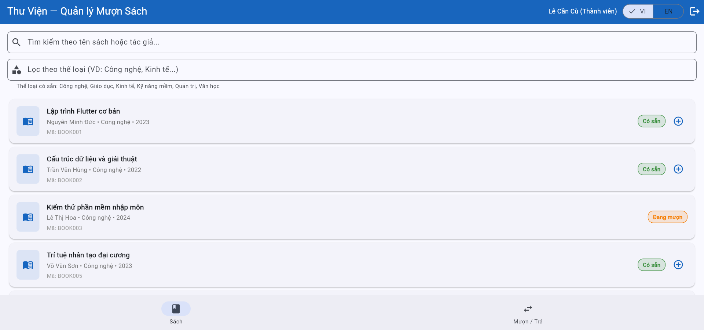
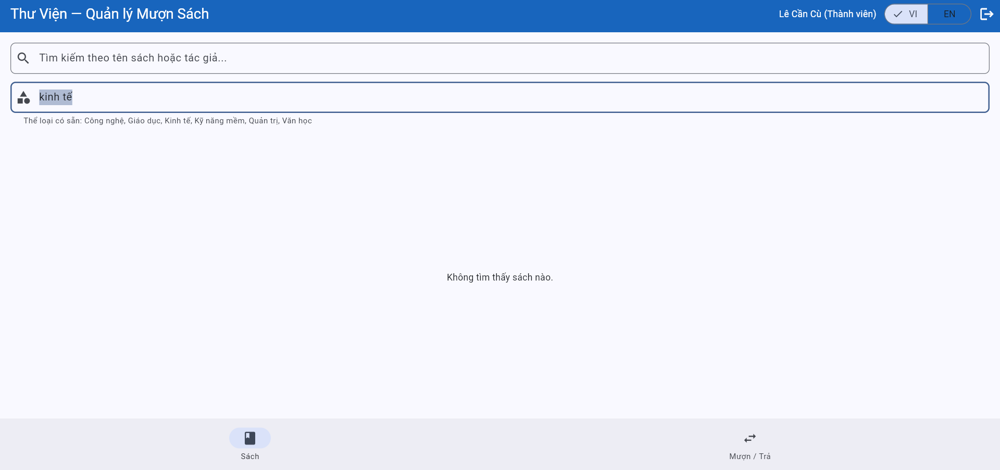
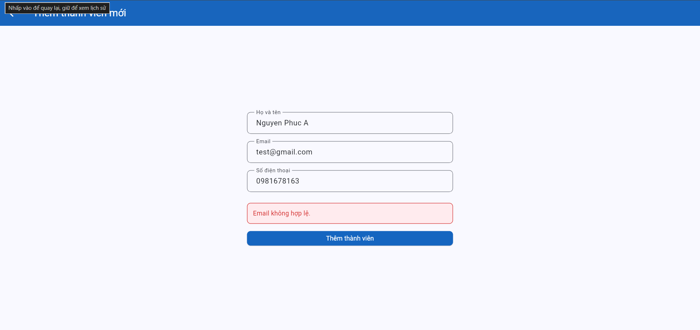

# Bug Reports — Báo cáo lỗi

> **Hướng dẫn**: Tạo 1 mục bug cho mỗi TC có kết quả **Fail**.
> Xem [examples/sample-bug-report.md](../examples/sample-bug-report.md) để hiểu cách viết bug report tốt.
> Mỗi bug cần: tiêu đề mô tả hành vi lỗi, bước tái hiện, expected vs actual, severity + giải thích.

| Thông tin | |
|---|---|
| **Nhóm** | `<!-- Tên nhóm -->` |
| **Ngày báo cáo** | `<!-- DD/MM/YYYY -->` |

---

## BUG-01

| Thuộc tính | Chi tiết |
|-----------|---------|
| **Mã lỗi** | BUG-01 |
| **TC liên quan** | `<!-- TC-xx -->` |
| **REQ liên quan** | `<!-- REQ-xx -->` |
| **Mức độ** | `<!-- High / Medium / Low -->` |
| **Người phát hiện** | `<!-- Họ tên thành viên -->` |
| **Ngày phát hiện** | `<!-- DD/MM/YYYY -->` |
| **Trạng thái** | `<!-- Open / Closed -->` |

**Tiêu đề:**
`<!-- Mô tả hành vi lỗi cụ thể -->`

**Môi trường:**
- Trình duyệt: Chrome `<!-- version -->`
- Hệ điều hành: `<!-- OS -->`
- Ngôn ngữ giao diện: Tiếng Việt

**Điều kiện tiên quyết:**
`<!-- VD: Trang đăng nhập đã mở, dữ liệu đã reset -->`

**Bước tái hiện:**
1. `<!-- Bước 1 -->`
2. `<!-- Bước 2 -->`
3. `<!-- Bước 3 -->`

**Kết quả mong đợi:**
`<!-- Kết quả đúng theo SRS -->`

**Kết quả thực tế:**
`<!-- Kết quả hệ thống thật sự trả về -->`

**Tác động:**
`<!-- VD: Vi phạm quy tắc nghiệp vụ cốt lõi, cho phép mượn vượt giới hạn -->`

**Minh chứng:**
`<!-- Đính kèm ảnh chụp màn hình nếu có -->`

**Đề xuất xử lý:**
`<!-- Gợi ý cách sửa lỗi nếu có -->` 

---

## BUG-01

| Thuộc tính | Chi tiết |
|-----------|---------|
| **Mã lỗi** | BUG-01 |
| **TC liên quan** | TC-12 |
| **REQ liên quan** | REQ-03 |
| **Mức độ** | High |
| **Người phát hiện** | Nguyễn Phúc Đức |
| **Ngày phát hiện** |29/05/2026 |
| **Trạng thái** | Open |

**Tiêu đề:**
Chức năng lọc sách không hoạt động, trả về danh sách rỗng với mọi giá trị hợp lệ

**Môi trường:**
- Trình duyệt: Chrome 148.0.7778.179
- Hệ điều hành: Windows 11 IoT Enterprise LTSC
- Ngôn ngữ giao diện: Tiếng Việt

**Điều kiện tiên quyết:**
Đã đăng nhập hệ thống với tài khoản Thành viên hoặc Thủ thư.
Đang ở Tab "sách" 

**Bước tái hiện:**
1. Mở màn hình Sách.
2. Tại ô Lọc theo thể loại, nhập một thể loại hợp lệ (ví dụ: Kinh tế).
3. Quan sát danh sách sách được hiển thị.
4. Thử lại với các thể loại khác như Công nghệ, Giáo dục, Quản trị, Văn học

**Kết quả mong đợi:**
Khi nhập Kinh tế, hệ thống chỉ hiển thị các sách thuộc thể loại Kinh tế (BOOK007, BOOK014, BOOK015 theo SRS và TC-12).
Các thể loại khác cũng phải trả về đúng danh sách sách tương ứng.

**Kết quả thực tế:**
Hệ thống hiển thị thông báo "Không tìm thấy sách nào."
Danh sách kết quả rỗng mặc dù trong hệ thống tồn tại sách thuộc thể loại đã nhập.
Lỗi xảy ra với mọi giá trị thể loại đã kiểm tra.

**Tác động:**
Người dùng không thể sử dụng chức năng lọc theo thể loại.
Vi phạm yêu cầu REQ-03 về tìm kiếm và lọc sách.
Gây khó khăn trong việc tra cứu sách khi số lượng sách lớn.
TC-12 thất bại.
**Minh chứng:**

**Đề xuất xử lý:**
Kiểm tra logic so sánh giá trị thể loại giữa dữ liệu sách và giá trị nhập từ ô lọc.

--- 
## BUG-02

| Thuộc tính | Chi tiết |
|-----------|---------|
| **Mã lỗi** | BUG-02 |
| **TC liên quan** | TC-25 |
| **REQ liên quan** | REQ-07 |
| **Mức độ** | High |
| **Người phát hiện** | Nguyen Phuc Duc |
| **Ngày phát hiện** | 29/05/2026 |
| **Trạng thái** | open |

**Tiêu đề:**
Không thể thêm thành viên mới do hệ thống từ chối mọi email hợp lệ

**Môi trường:**
- Trình duyệt: Chrome 148.0.7778.179
- Hệ điều hành: Windows 11 IoT Enterprise LTSC
- Ngôn ngữ giao diện: Tiếng Việt

**Điều kiện tiên quyết**
Đăng nhập bằng tài khoản Thủ thư.
Đang ở màn hình Thành viên → Thêm thành viên mới.

**Bước tái hiện:**
1. Đăng nhập với tài khoản Thủ thư.
2. Mở màn hình Thêm thành viên mới.
3. Nhập họ tên hợp lệ. (ví dụ: Nguyen Van A)
4. Nhập email hợp lệ (ví dụ: test@gmail.com hoặc các email hợp lệ khác).
5. Nhập số điện thoại hợp lệ (ví dụ: 0981677166)

**Kết quả mong đợi:**
Hệ thống chấp nhận email hợp lệ, tạo thành viên mới thành công và hiển thị thành viên trong danh sách.

**Kết quả thực tế:**
Hệ thống luôn hiển thị thông báo: "email không hợp lệ"

**Tác động:**
Thủ thư không thể thêm thành viên mới vào hệ thống.
Chức năng Quản lý thành viên (REQ-07) không thể sử dụng.
TC-25 thất bại.
Ảnh hưởng trực tiếp đến nghiệp vụ quản lý thư viện.

**Minh chứng:**

**Đề xuất xử lý:**
Kiểm tra logic kiểm tra định dạng email trên form thêm thành viên.

---

<!-- Copy template BUG trên để thêm BUG-03, BUG-04, ... cho mỗi TC Fail -->
