# Test Execution — Kết quả thực thi kiểm thử

> **Hướng dẫn**: Chạy từng TC trên hệ thống https://stqa.rbc.vn, ghi lại kết quả thực tế.
> Kết luận: **Pass** (kết quả đúng), **Fail** (kết quả sai → tạo bug report), **Blocked** (không thực hiện được vì lỗi khác chặn), **Not Run** (chưa chạy).

| Thông tin | |
|---|---|
| **Nhóm** | `GROUP_04` |
| **Ngày thực thi** | ` 29/05/2026 ` |
| **Trình duyệt** | Chrome `148.0.7778.217(64 bit)` |
| **Hệ điều hành** | ` Windows ` |

---

## Kết quả chi tiết
### REQ-01/Login
| TC ID | Functional Group | Expected Result (Summary) |  Actual Result  | Actual Result  | Proof  | Bug |
|-------|------------------|---------------------------------------------------------|----------------------------------------------------------------|---------|-----------|----| 
| TC-01 |   Login   |  Navigate to the homepage. AppBar shows username and role "Thủ thư".         |  Navigate to the homepage. AppBar shows "Nguyễn Thủ Thư" and role "Thủ thư".The "Thành viên" tab is visible in the menu.         |**Pass**|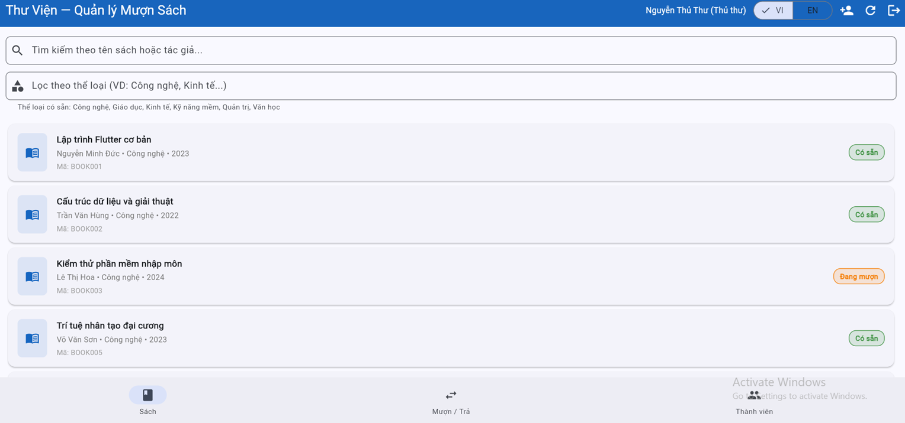|  -   |
| TC-02 |   Login   |  Navigate to the homepage. AppBar shows username and role "Thành viên".      |  Navigate to the homepage. AppBar shows "Nguyễn Học Bá" and role "Thành viên".The "Thành viên" tab is not visible in the menu.   |**Pass**|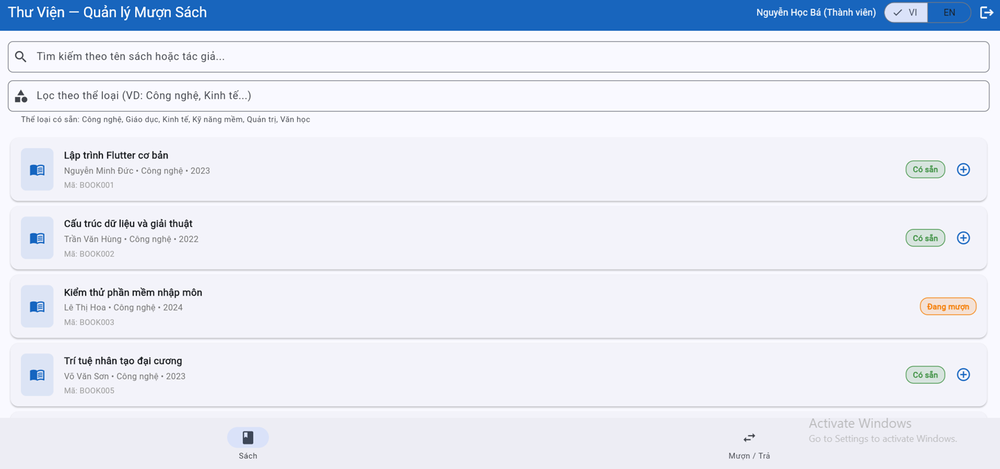|  -   | 
| TC-03 |   Login   |  The system displays the error message "Không tìm thấy thành viên ".         |  The system displays the error message "Không tìm thấy thành viên".The page does not navigate.                                   |**Pass**|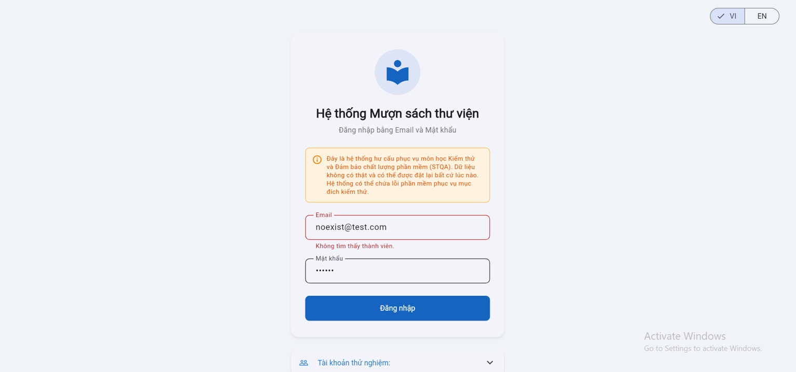|  -   | 
| TC-04 |   Login   |  The system displays the error message "Mật khẩu không đúng" in the **Password** field                |  The system displays the error message "Mật khẩu không đúng" in the **Email** field.The page does not navigate.                                         |**Fail**||BUG|
| TC-05 |   Login   |  Displays "Vui lòng nhập email và mật khẩu".The page does not redirect.      | Displays "Vui lòng nhập email và mật khẩu".The page does not redirect.                                                           |**Pass**|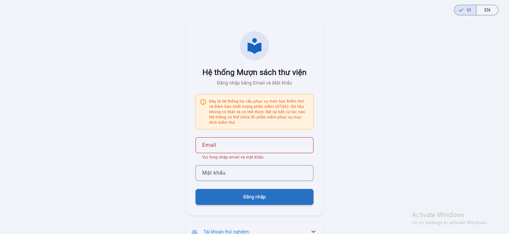|  -   | 
### REQ-02/View Book List
| TC ID | Functional Group | Expected Result (Summary) |  Actual Result  | Actual Result  | Proof  | Bug |
|-------|------------------|---------------------------------------------------------|----------------------------------------------------------------|---------|-----------|----| 
| TC-06 |  View Book List  | Displays the list of books from the seed data.Each book shows: title, author, genre, publication year, and status("Có sẵn","Thất lạc","Đang mượn")  | Displays all 20 books with 5 fields (Title, Author, Genre, Publication Year, Status).BOOK007 and BOOK020 display status "Thất lạc". BOOK003 and BOOK013 displays "Đang mượn". |**Pass**|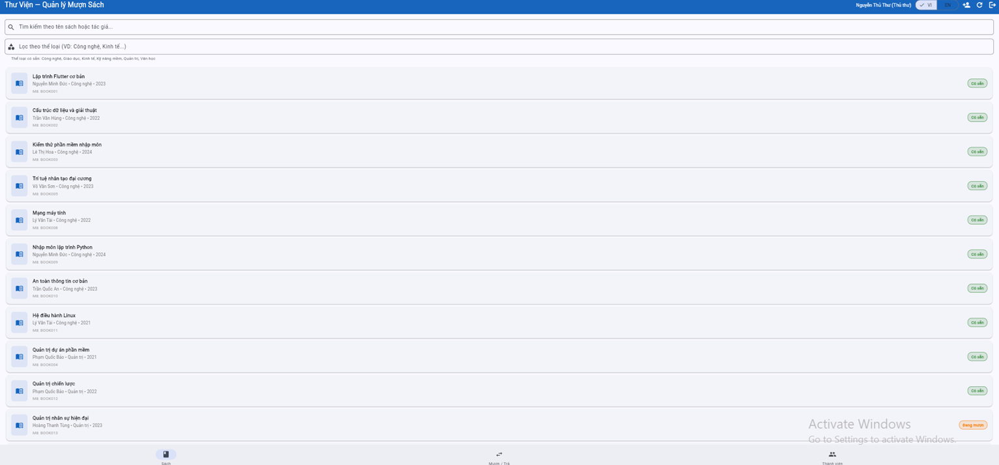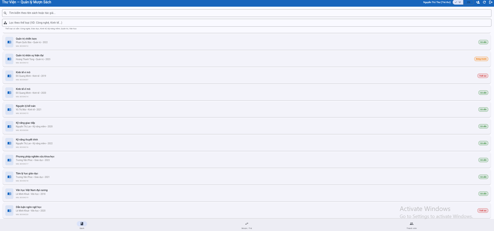|  -  |  
| TC-07 |  View Book List  | After borrowing, BOOK001 immediately changes status to "Borrowed" in the list — no page refresh required.   |  After borrowing, BOOK001 immediately changes status to "Borrowed" in the list — no page refresh required. |**Pass**|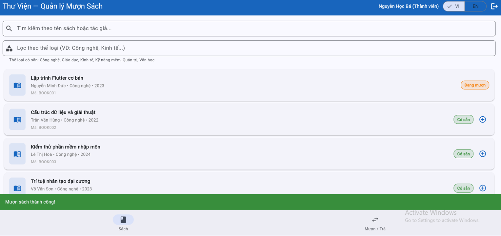|  -  |  
| TC-08 |  View Book List  | The member can view all 20 books with complete information, the same as the librarian — no books are hidden. | The member can view all 20 books with complete information, the same as the librarian — no books are hidden. |**Pass**|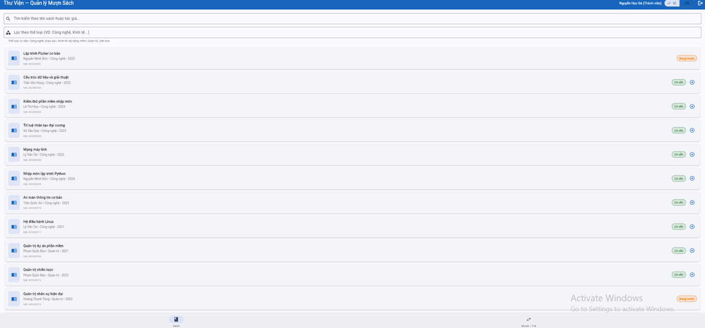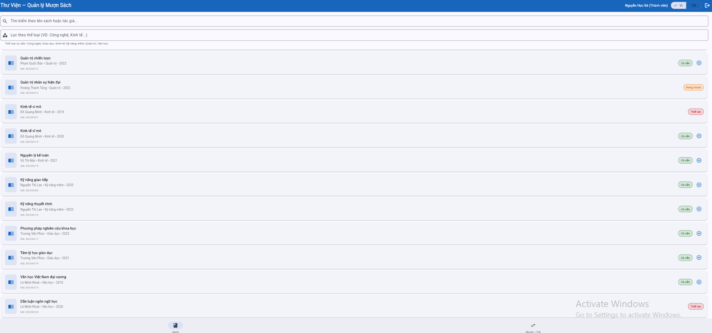|  -  |  
### REQ-03/Search and Filter Books 
| TC ID | Functional Group | Expected Result (Summary) |  Actual Result  | Actual Result  | Proof  | Bug |
|-------|------------------|---------------------------------------------------------|----------------------------------------------------------------|---------|-----------|----| 
| TC-09 |  Search and Filter Books   |  Shows BOOK001 — "Lập trình Flutter cơ bản".Result is the same as entering `"Flutter"` or `"FLUTTER"`.  | Only displays BOOK001 "Lập trình Flutter cơ bản". Other books are hidden.Result is the same as entering `"Flutter"` or `"FLUTTER"` |**Pass**|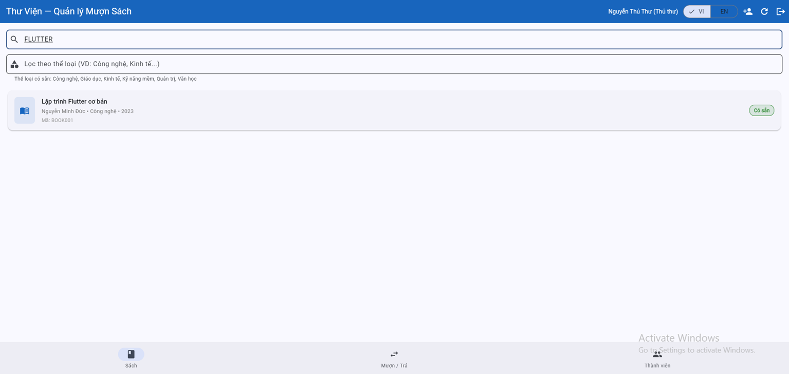|  -   |
| TC-10 |  Search and Filter Books   |  Shows BOOK001 and BOOK009 — both by the same author when searching "Nguyễn Minh Đức"  |  Displays BOOK001 and BOOK009. Books by other authors are hidden.  |**Pass**|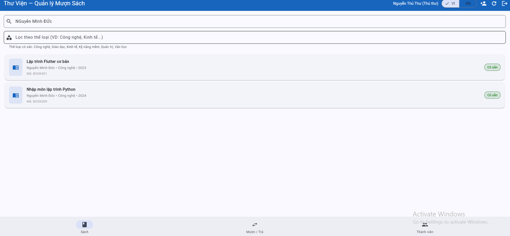|  -   | 
| TC-11 |  Search and Filter Books   |  List is empty, shows message "No books found".         |   List is empty, shows message "No books found".  |**Pass**|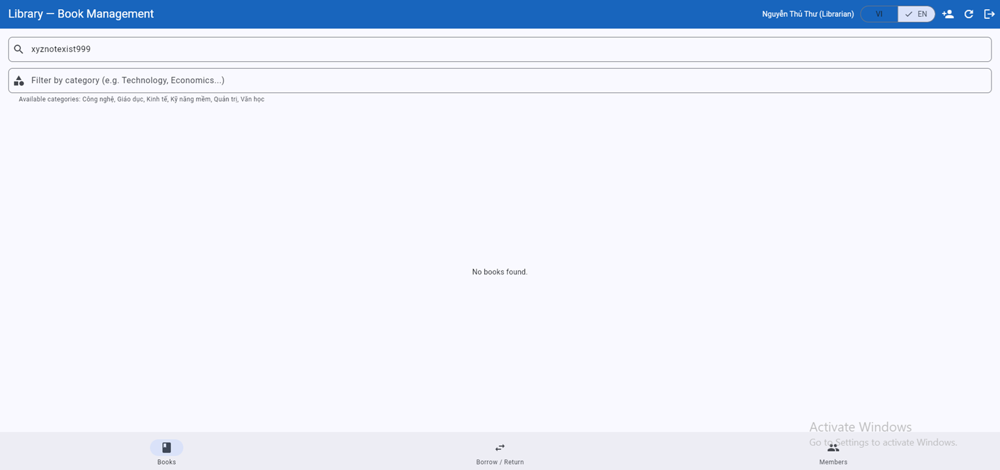|  -   | 
| TC-12 |  Search and Filter Books   |  Shows only 3 books: BOOK007 (Kinh tế vi mô), BOOK014 (Kinh tế vĩ mô), BOOK015 (Nguyên lý kế toán). No books from other categories.| Shows only **3 books**: BOOK007, BOOK014, BOOK015. |**Pass**|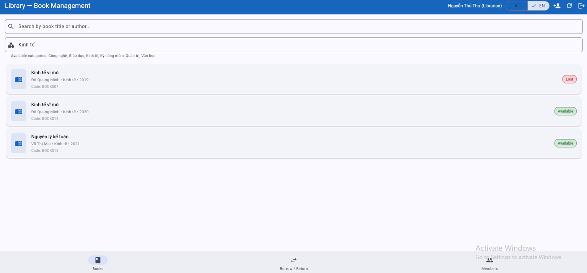|  -   |
| TC-13 |  Search and Filter Books   |  Shows only 3 books: BOOK007 (Kinh tế vi mô), BOOK014 (Kinh tế vĩ mô), BOOK015 (Nguyên lý kế toán). No books from other categories.|  List is empty, shows message "No books found". |**Fail**|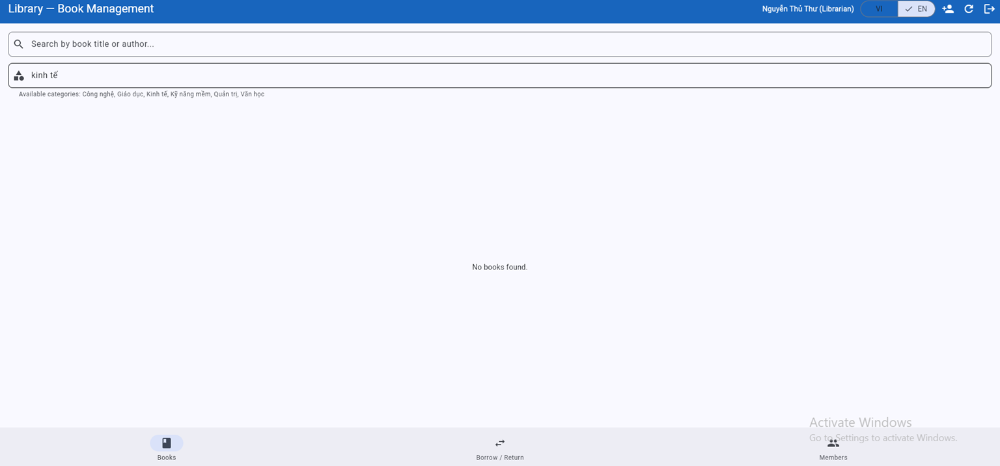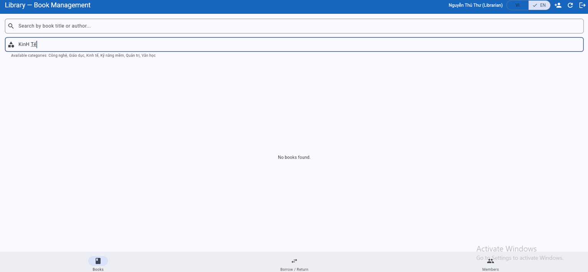|BUG |   
| TC-35 |  Search and Filter Books   |  The system should display the book "Lập trình Flutter cơ bản" because its title matches the entered keywords.|The system displays "No books found" for both "Lập" and "lap", even though the matching book exists in the system. |**Fail**|[TC35-1](test-case-image/TC35-1.png)[TC35-2](test-case-image/TC35-2.png)|  BUG  | 
### REQ-04/Borrow Book
| TC ID | Functional Group | Expected Result (Summary) |  Actual Result  | Actual Result  | Proof  | Bug |
|-------|------------------|---------------------------------------------------------|----------------------------------------------------------------|---------|-----------|----| 
| TC-14 |  Borrow Book   |   New borrow slip created successfully. Due date = **today + 14 days**. Slip status: **"Borrowed"**. BOOK001 changes to **"Borrowed"**. |New borrow slip created successfully. Due date = **today + 14 days**. Slip status: **"Borrowed"**. BOOK001 changes to **"Borrowed"**. |**Pass**|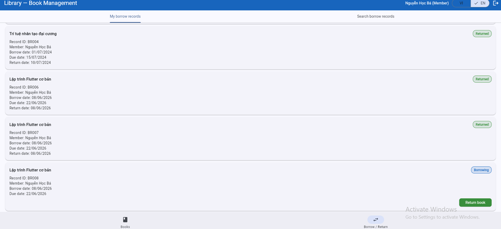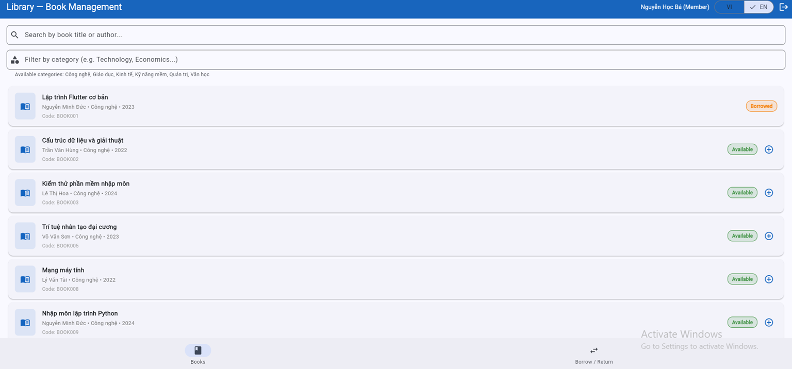|  -   |
| TC-15 |  Borrow Book   |  System rejects and shows error message: book is **unavailable** / already borrowed. No new slip created. | BOOK003 does not have the (+) button,the borrow action cannot be performed.No error message is displayed. |**Fail**|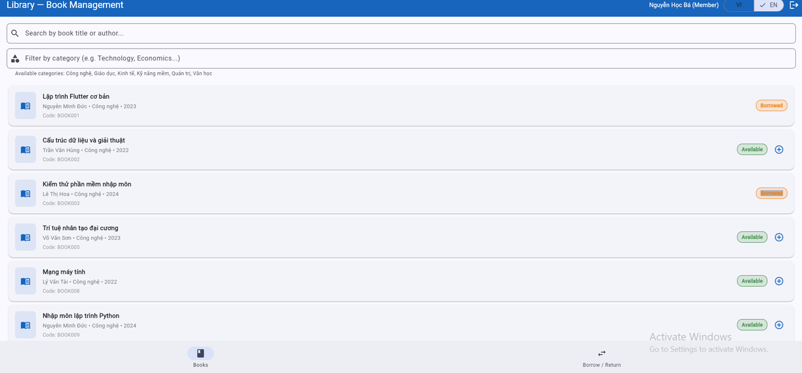|  BUG   | 
| TC-16 |  Borrow Book   |  System rejects and shows reason **"Suspended"** — message must be different from the "Expired" case. No slip created.| System rejects and shows error message:"Thành viên đã hết hạn. Không thể mượn sách."-the same message as the "Expired" case. |**Fail**|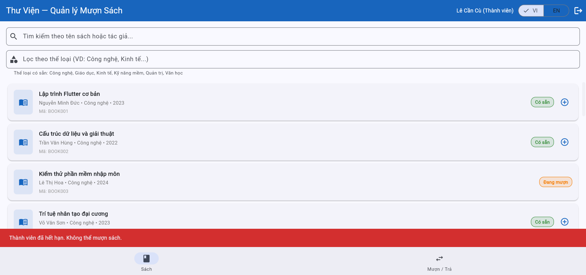|  BUG   | 
| TC-17 |  Borrow Book   |  System rejects and shows reason **"Expired"**. No slip created.| System rejects and shows error message:"Thành viên đã hết hạn. Không thể mượn sách." |**Pass**|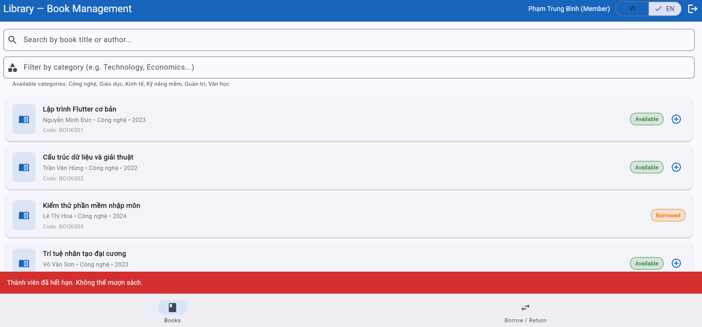|-|
| TC-18 |  Borrow Book   |  Borrow **successful** — 3rd slip created. Total currently borrowed = **3**. No error message.|  Borrow **successful** — 3rd slip created. Total currently borrowed = **3**. No error message. |**Pass**|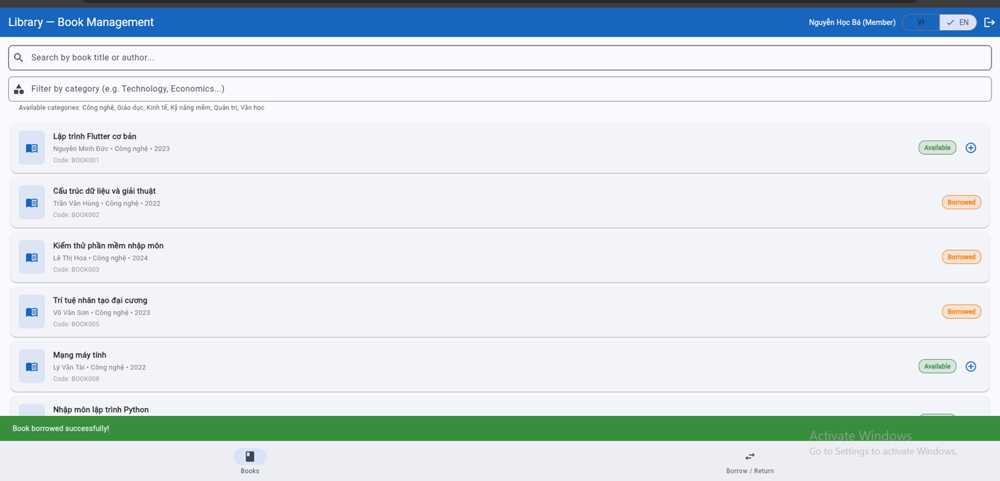|  -   | 
| TC-19 |  Borrow Book   |  System rejects and shows message: **"3-book limit reached"** (or equivalent). No 4th slip created.|The system creates an additional borrowing record, allowing the member to have four active borrowed books at the same time. |**Fail**|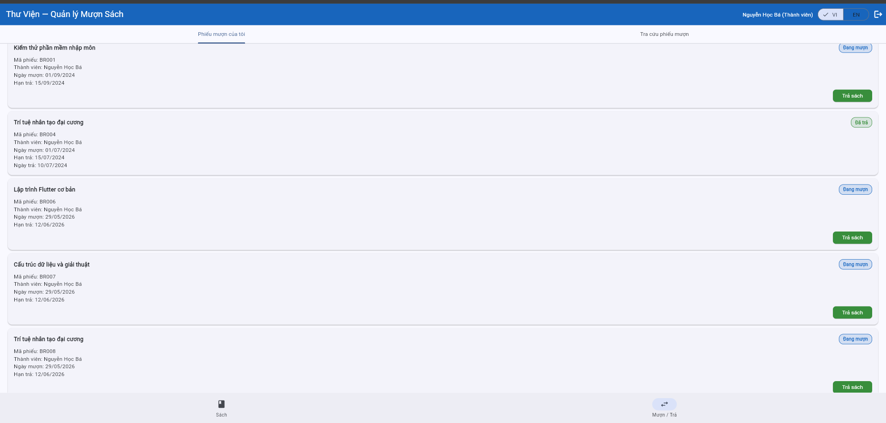|BUG |
| TC-20 |  Borrow Book   |  Shows reason "Thành viên đã hết hạn. Không thể mượn sách." in VI or "The member account has expired. Borrowing books is not allowed." in EN|Shows reason "Thành viên đã hết hạn. Không thể mượn sách." in VI and EN |**Fail**|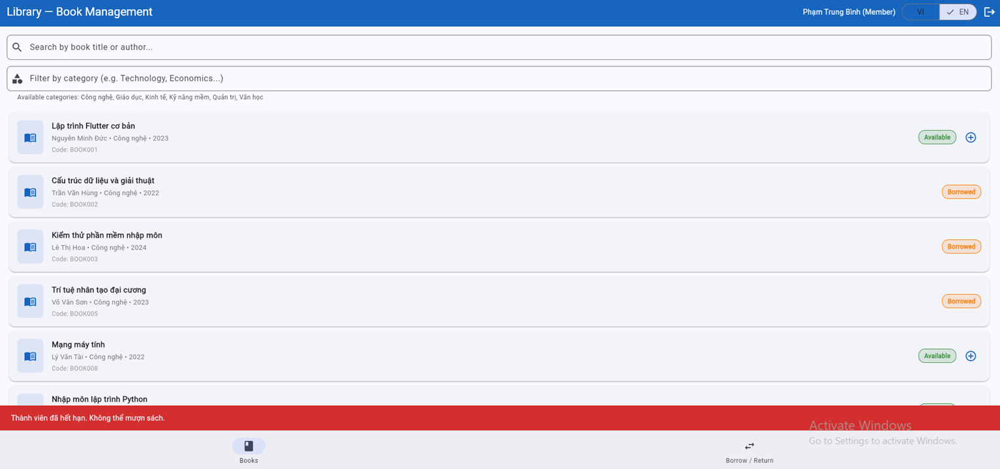|BUG |
---

#### REQ-05/Return Book

| TC ID | Functional Group | Expected Result (Summary) | Actual Result | Actual Result | Proof | Bug |
|--------|------------------|--------------------------|---------------|---------------|-------|-----|
| TC-21 | Return Book | Return successful. BR003 changes to "Returned". BOOK013 changes to "Available". | BR003 was returned successfully. Status changed to "Returned" and BOOK013 became "Available". | **Pass** | - | - |
| TC-22 | Return Book | System shows overdue warning before confirmation. After return: BR001 → "Returned", BOOK003 → "Available". | Overdue warning was not handled correctly because overdue status processing is inconsistent. | **Fail** | Screenshot | BUG-02 |
| TC-23 | Return Book | BOOK003 can be borrowed normally after being returned. | BOOK003 could be borrowed again after return and a new borrow slip was created. | **Pass** | - | - |
| TC-24 | Return Book | Member cannot return a book borrowed by another member. | Member account was able to return a book belonging to another member. | **Fail** | 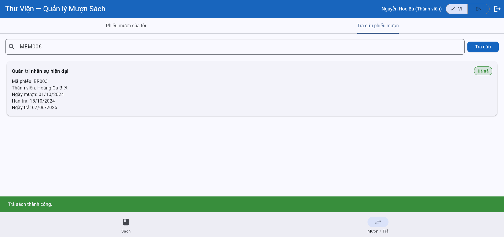 | BUG-11 |

#### REQ-06/Overdue Processing

| TC ID | Functional Group | Expected Result (Summary) | Actual Result | Actual Result | Proof | Bug |
|--------|------------------|--------------------------|---------------|---------------|-------|-----|
| TC-25 | Overdue Processing | BR001 changes to "Overdue". BR003 remains "Borrowed". | Overdue check produced inconsistent results. Borrow slips were not flagged correctly. | **Fail** | Screenshot | BUG-02 |
| TC-26 | Overdue Processing | "Check Overdue" button is hidden from Members. | The "Check Overdue" button was not displayed for Member accounts. | **Pass** | - | - |
| TC-27 | Overdue Processing | Member sees BR001 with status "Overdue". | BR001 status was not updated/displayed correctly after overdue processing. | **Fail** | Screenshot | BUG-02 |

#### REQ-07/Member Management

| TC ID | Functional Group | Expected Result (Summary) | Actual Result | Actual Result | Proof | Bug |
|--------|------------------|--------------------------|---------------|---------------|-------|-----|
| TC-28 | Member Management | New member appears in the list with status "Active". | System rejected valid email address `test.new@gmail.com`. No member was created. | **Fail** | Screenshot | BUG-08 |
| TC-29 | Member Management | Invalid email `user@domain` is rejected. | Unable to verify invalid-email validation because the system already rejects valid email addresses. | **Blocked** | Screenshot | BUG-08 |
| TC-30 | Member Management | Existing email is rejected with duplicate-email message. | Unable to verify duplicate-email validation because Add Member fails before reaching this validation. | **Blocked** | Screenshot | BUG-08 |
| TC-31 | Member Management | 9-digit phone number is rejected. | Unable to verify phone-number validation because the form rejects valid email input. | **Blocked** | Screenshot | BUG-08 |

#### REQ-08/Borrow Slip Lookup

| TC ID | Functional Group | Expected Result (Summary) | Actual Result | Actual Result | Proof | Bug |
|--------|------------------|--------------------------|---------------|---------------|-------|-----|
| TC-32 | Borrow Slip Lookup | Member sees only their own borrow slips. | Member account could view borrow slips belonging to other members. | **Fail** | submissions/BUG_TC32.png | BUG-011 |
| TC-33 | Borrow Slip Lookup | Librarian can view all borrow slips from all members. | Librarian could view all borrow slips from multiple members. | **Pass** | - | - |
| TC-34 | Borrow Slip Lookup | Borrow slip displays all required fields. | BR001 displayed Slip ID, Book Borrowed, Borrow Date, Due Date and Status correctly. | **Pass** | - | - |
## Tổng hợp kết quả

| Chỉ số | Giá trị |
|--------|---------|
| Tổng số test case | `<!-- số -->` |
| Pass | `<!-- số -->` |
| Fail | `<!-- số -->` |
| Blocked | `<!-- số -->` |
| Not Run | `<!-- số -->` |
| **Tỷ lệ Pass** | `<!-- xx% -->` |

### Kết quả theo nhóm chức năng

| Nhóm | Tổng TC | Pass | Fail | Tỷ lệ Pass |
|------|---------|------|------|------------|
| | | | | |
